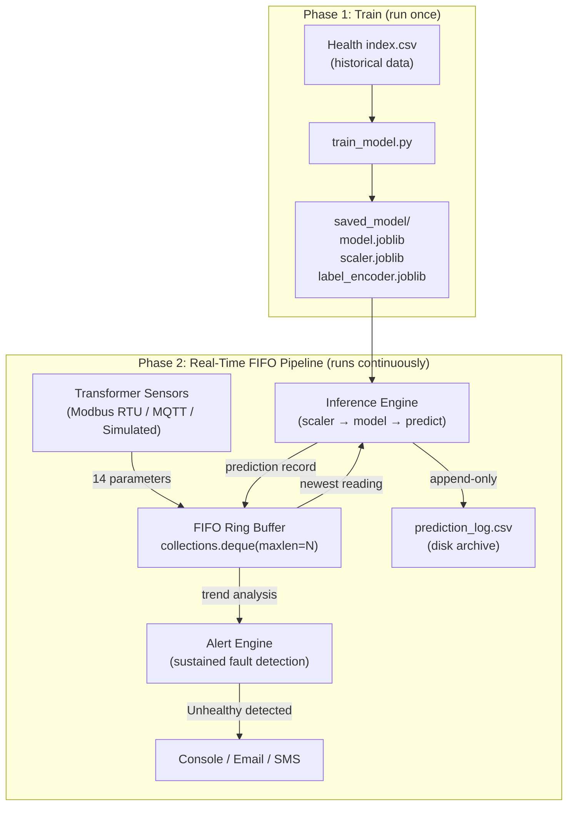

# Real-Time Transformer Health Monitoring — FIFO Queue Architecture

## Architecture Overview



**Key principle**: Sensor data flows directly into a **FIFO ring buffer** in memory → immediate inference → prediction stored back in the buffer. No intermediate CSV is read or written in the live loop. A disk log file is appended as a background archive, but the inference path is entirely in-memory.

## Proposed Changes

### Phase 1 — Training Script

#### [NEW] [train_model.py](file:///c:/Users/abwor/Desktop/ensemble/train_model.py)

Extracts all training logic from the existing script. Trains the 4 base models + 2 ensembles, prints the comparison table, then exports the best model + scaler + label encoder to `saved_model/`. Run this **once** (or re-run when you want to retrain on new historical data).

---

### Phase 2 — Real-Time FIFO Monitor

#### [NEW] [realtime_monitor.py](file:///c:/Users/abwor/Desktop/ensemble/realtime_monitor.py)

The core of the system. Runs as a long-lived process with this internal architecture:

```
┌─────────────────────────────────────────────────────────────────────┐
│                    realtime_monitor.py  Process                     │
│                                                                     │
│  ┌─────────────┐    ┌──────────────────────────────────────────┐   │
│  │ Data Source  │    │  FIFO Ring Buffer (deque, maxlen=N)      │   │
│  │ ─────────── │    │                                          │   │
│  │ Modbus RTU  │───▶│  [record_t-N+1] → ... → [record_t]     │   │
│  │   or MQTT   │    │                                          │   │
│  │   or SIM    │    │  Each record:                            │   │
│  └─────────────┘    │    .timestamp   (datetime)               │   │
│                     │    .features    (dict of 14 floats)      │   │
│                     │    .status      (Healthy/Unhealthy/...)  │   │
│                     │    .confidence  (0.0 – 1.0)              │   │
│                     │    .probabilities (dict per class)       │   │
│                     └────────────┬─────────────────────────────┘   │
│                                  │                                  │
│                     ┌────────────▼─────────────────────────────┐   │
│                     │  Inference Engine                         │   │
│                     │  scaler.transform() → model.predict()    │   │
│                     └────────────┬─────────────────────────────┘   │
│                                  │                                  │
│              ┌───────────────────┼───────────────────┐             │
│              ▼                   ▼                   ▼             │
│  ┌───────────────────┐ ┌─────────────────┐ ┌────────────────┐    │
│  │ Alert Engine      │ │ Trend Analyzer  │ │ Disk Logger    │    │
│  │ (sustained fault  │ │ (rolling stats, │ │ (append-only   │    │
│  │  detection over   │ │  rate-of-change │ │  CSV archive)  │    │
│  │  last K readings) │ │  from buffer)   │ │                │    │
│  └───────────────────┘ └─────────────────┘ └────────────────┘    │
└─────────────────────────────────────────────────────────────────────┘
```

**Data sources** (selectable via `--source` flag):
- `modbus` — Reads Modbus RTU registers from sensors over RS485 serial
- `mqtt` — Subscribes to MQTT topic and receives JSON payloads
- `simulate` — Replays rows from the historical CSV one-by-one (for testing without hardware)

**FIFO buffer details**:
- `collections.deque(maxlen=N)` — O(1) push/pop, auto-evicts oldest when full
- Default N=1440 (24 hours of history at 60-second intervals)
- Enables sustained-alert detection (alert only if last K predictions are all unhealthy)
- Enables rolling statistics and rate-of-change analysis

---

### Dependencies

#### [NEW] [requirements.txt](file:///c:/Users/abwor/Desktop/ensemble/requirements.txt)

All Python dependencies for both scripts.

## Verification Plan

### Manual Verification
1. Run `train_model.py` → verify `saved_model/` contains 3 `.joblib` files.
2. Run `realtime_monitor.py --source simulate --csv-file "Health index.csv" --interval 2` → verify predictions print continuously, FIFO buffer status is shown, and `prediction_log.csv` is appended.
3. Verify alert triggers after sustained unhealthy predictions.
